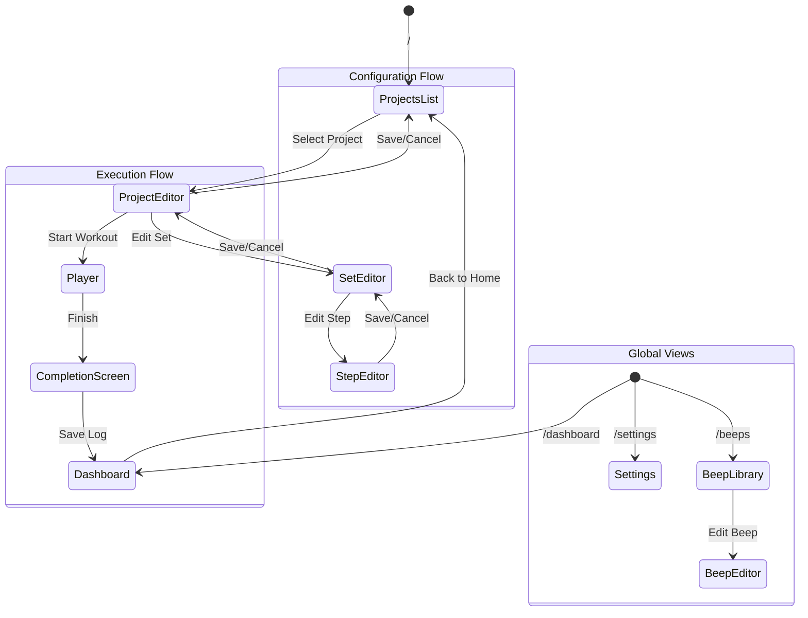
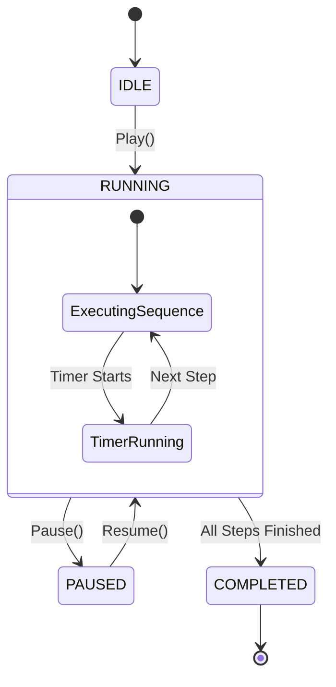
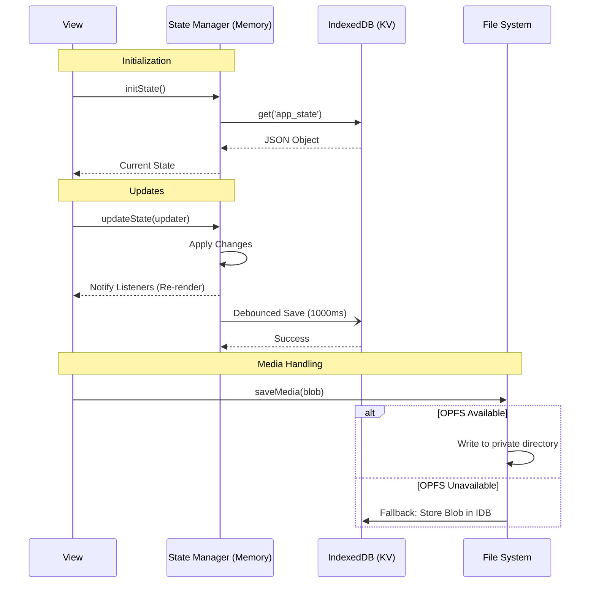
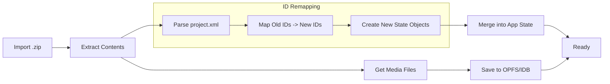

# Application Architecture

This document provides a technical overview of the "Personalized Exercise" application. It covers the high-level system design, navigation flows, the core player execution engine, data persistence strategies, and the import/export workflows.

## 1. System Overview

The application is a **Progressive Web App (PWA)** built with **Vanilla JavaScript (ES Modules)**. It requires no build step (other than bundling dependencies if needed, though it currently uses CDNs) and runs directly in modern browsers.

*   **Core Stack:** HTML5, CSS3, JavaScript (ES6+).
*   **State Management:** Centralized in-memory store (`state.js`) with subscription-based reactivity.
*   **Storage:** Hybrid model using **IndexedDB** for structured data and **OPFS (Origin Private File System)** for media blobs.
*   **Audio:** Web Audio API for synthesized beeps and `window.speechSynthesis` for TTS.
*   **Architecture Pattern:** Component-based views managed by a lightweight hash-based Router.

## 2. Navigation & User Flow

The application uses a custom `Router` (`src/lib/router.js`) that listens to `hashchange` events. Views are instantiated as classes and rendered into the main `#app` container.

### Route Logic
*   **/**: Projects List (Home)
*   **/project/:id**: Project Editor (Drill down into Sets)
*   **/project/:pid/set/:sid**: Set Editor (Drill down into Steps)
*   **/player/:id**: Workout Player (Execution)

### Navigation Diagram



## 3. Player Execution Engine

The core value of the app is the `PlayerView` (`src/views/player.js`). It transforms a hierarchical project structure (Sets -> Steps) into a linear playlist and executes it with precise timing.

### Logic Flow
The player uses a recursive-like sequence runner combined with `requestAnimationFrame` for the timer.

```mermaid
flowchart TD
    Start[Start Play] --> InitAudio[Init AudioContext & WakeLock]
    InitAudio --> Execute[Execute Sequence Item]

    subgraph Sequence [Step Execution Sequence]
        TTS[1. TTS Announcement] -->|Wait| DelayTTS["Delay (TTS -> Beep)"]
        DelayTTS --> StartBeeps[2. Start Beeps]
        StartBeeps -->|Wait| DelayBeep["Delay (Beep -> Timer)"]
        DelayBeep --> StartTimer[3. Start Timer Loop]
    end

    Execute --> Sequence

    subgraph TimerLoop [RAF Timer Loop]
        CheckDelta[Calc Time Delta] --> UpdateUI[Update Display]
        UpdateUI --> CheckInterval[Check Interval/Countdown Beeps]
        CheckInterval --> CheckEnd{Time <= 0?}
        CheckEnd -- No --> TimerLoop
    end

    StartTimer --> TimerLoop

    CheckEnd -- Yes --> EndBeeps[Play End Beeps]
    EndBeeps --> NextItem[Load Next Item]
    NextItem --> Execute

    NextItem -- No Items Left --> Complete[Complete Workout]
```

### Player State Machine



## 4. Data Architecture

The application uses a "Load-All, Save-Debounced" strategy for the structured data, and an on-demand strategy for binary media.

*   **App State (`kv` store):** Holds Projects, Sets, Steps, Settings, and Logs.
*   **Media (`media` store/OPFS):** Holds user-uploaded images/GIFs.

### Data Persistence Flow



## 5. Import/Export Workflow

Projects are portable via a custom `.zip` package format.

*   **Format:** ZIP Archive
*   **Content:**
    *   `project.xml`: Validated XML description of the project, sets, steps, and beeps.
    *   `media/`: Folder containing referenced assets.

### Import Logic

When importing a project, IDs must be remapped to avoid collisions with existing data.


